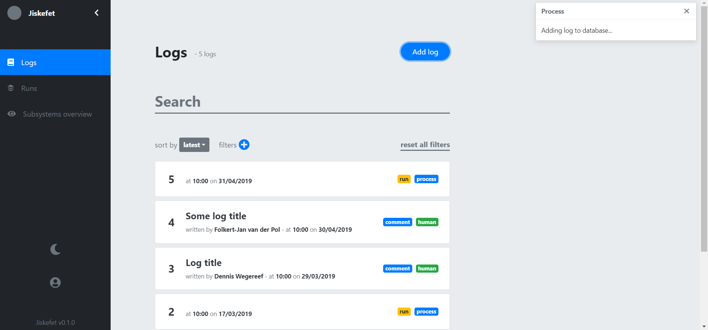
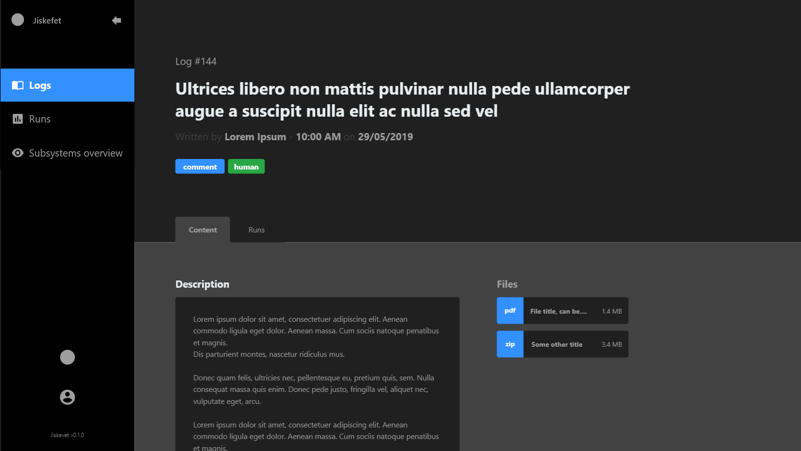

# Project 3 @cmda-minor-web · 2018-2019


## Summary
A proposed redesign of parts of the UI and UX for a bookkeeping program called Jiskefet, currently in development for CERN.

## Table of contents
1. [Demo](#demo)
2. [Install](#install)
3. [Concept](#concept)
4. [Design](#design)
    1. [Comparison 1: Log list](#comparison-1-log-list)
    2. [Comparison 2: Adding a log](#comparison-2-adding-a-log)
    3. [Comparison 3: Log detail page](#comparison-3-log-detail-page)
    4. [General design / user experience improvements](#general-design-user-experience-improvements)
5. [Prototype](#prototype)
6. [To-do](#to-do)

[License](#license)

## Demo
A live prototype can be viewed on [netlify](https://cern.netlify.com/#/logs).

## Install
```bash
## Clone Project
git clone https://github.com/follywolly/project-3-1819

## Navigate to the project folder
cd project-3-1819

## Install dependencies
npm install

## Start live server on localhost:8080
npm run serve
```

## Design
I made a total of 11 different screens for the revision of the user interface, seen below.


### Comparison 1: Log list
#### Current log list


#### Revised log list


#### Improvements
##### 1. Sidebar menu
As seen above, the current navigation (dark sidebar) shows what page in the webapp you are currently viewing. To improve peoples idea of where they are, I added an extra indication to show where people currently are by changing the color of the currently active page from grey to blue.

For now I decided to get rid of the top bar, since its only purpose is to host the account menu. I moved that to the sidebar to increase the available space on the screen, so more content can be shown.

###### Previous & Improved version side to side


##### 2. Filters and search options
As seen on the **current log list** above, the filter and search options are combined together in a little submenu to the side of the main content. It takes up quite alot of space, which is a loss since sometimes there needs to be a lot of content on the screen (especially on the **runs** page)
###### Current state


###### Improved state 1


I decided to split the menu into a search bar and a filter and sort bar. The search bar can be used to type in a log/run **ID**, a log/run **Author** or a log/run **Title**. You can even go more specific by typing a combination of those values seperated by commas.

###### Improved state 2


The filter options can be added via a popup menu, and be changed at any time by clicking their respective delete button (red button with trash can icon) or reseting all filters with a small button to the right of the sort & filter bar.

### Comparison 2: Adding a log
Currently, adding a log happens on a seemingly standalone page. This seems to be okay, since you are focussed on one task only: adding a log. The problem however, is that you can add a log from a run's detail page and from the menu. This can cause disorientation for users as they will have to remember the path they took to get there, or constantly look for clues if they are adding the log from the right place, for the right run / log.

#### Current state


#### Improved state


My suggestion is to move the adding of logs to a small popup, which shows the user visually in the background where they started to add a log from. This improves their idea of the path they took and gives them a better understanding of their context within the webapp. The popup opens upon clicking the add log button in the logs list screen or when you click the add log / comment button on a run / log detail page.

### Comparison 3: Log detail page
Currently, the detail page of logs are hard to navigate. There is a lack of visual clues as to what is important content, and alot of information is hidden behind tabs when they don't necessarily need to be.

#### Current state


#### Improved state


### General design / user experience improvements

#### 1. Visual hierarchy
I redesigned the whole application to add more **visual hierarchy** to the webapp. Visual hierarchy means making content that's most important for context, navigation or general purpose of the webapp pop out of the screen more, by using bright colors for important elements, making them bigger, or giving them more space. The current version lacks this visual hierarchy, making it harder to skim through the pages searching for the specific content you need.

##### Current version


No visual hierarchy in the list view, no title, hard to see what's important or where you currently are within the webapp.

##### Improved version


Clear page title, more space around important action elements (add log, search) and a visual hierarchy in the list view: more prominent show of ID, author and time smaller than title, etc.

#### 2. Feedback
##### While sorting / filtering the list of logs
When sorting lists, adding filters or searching the list of logs shifts and animates to show the reflowing of the items in the list. Check the [prototype](#prototype) and sort the list of logs to see the animations!

##### While adding a log
When adding a log, I added a status message in the top left corner that indicates that the log is being added to the database, and when it is, it shows an updated message:




Check the [prototype](#prototype) and add a log to see it in action!

#### 3. Dark mode
Since the people making the logs work both morning, evening and night shifts, I decided to add a so-called dark mode, where most bright colors invert to dark colors, to not be so painful to the eye.


## Prototype
A working prototype is live! I didn't manage to finish the detailpages of logs and runs, and the runs and subsystems overview pages are currently empty as well.

Features working:
- Dark mode
- Filtering
- Searching
- Sorting
- Adding a log
- Browsing logs

#### URL
https://cern.netlify.com/#/logs d

## To-do
- [x] Log / run detail pages
- [x] Adding / showing comments
- [ ] Show runs log is based on
- [ ] Runs list page
- [ ] Welcome / account screen
- [ ] Input sanitization
- [ ] Editing logs

## License
[MIT](LICENSE) @ [FollyWolly](https://github.com/follywolly)
